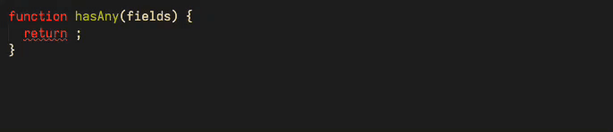

</img>

# Firestore Rules LSP VSCode Extension

</img>

This extension in comparison to others available in the market place, utilizes a LSP (Language Server Provider) and does not rely on semantic calculations on the extension level.

Upon preparation the extension simply wraps around it, and can utilze the features that the LSP is able to provide instead of running its own calculations.

The LSP runs natively on machine (its not a node app) so that memory and cpu overhead is kept at minium.

The source code of the LSP can be found [here](https://github.com/JulindM/firestore-rules-lsp)

### Current features

- Syntax highlighting
  - Make sure the theme you are using support semantic color tokenizations, otherwise you will not see colors. The default VSCode theme does have this feature.
- Autocomplete
- Go to definition
- Find references
- Type inference
- Linting
  - Wrong return type for `if` rules
- Method/Variable documentation
- Syntax errors
